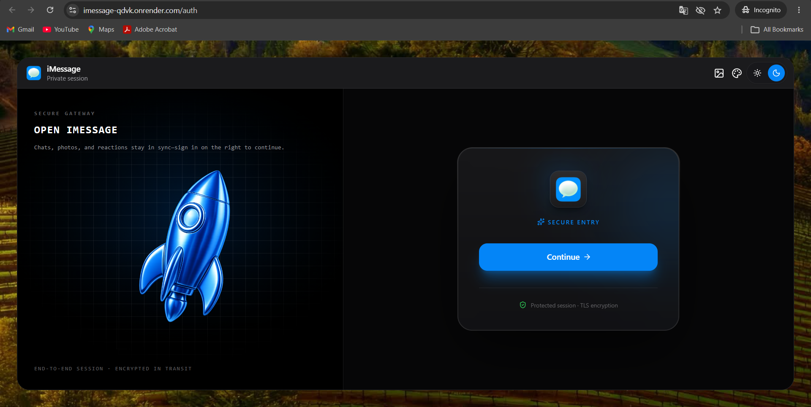
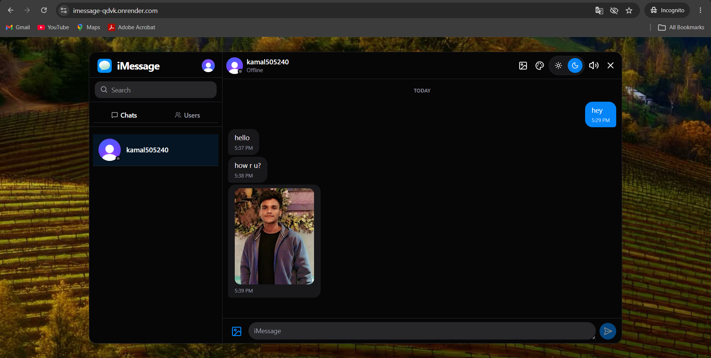

# 💬 iMessage — Real-Time Chat App

> A full-stack iMessage-inspired chat application built with MERN stack and Socket.io

🔗 Live Demo: https://imessage-qdvk.onrender.com

---

## 📸 Screenshots

| Login Page |

| Chat View |

---

## ✨ Features

- ⚡ Real-time messaging with Socket.io
- 🟢 Online/offline user presence tracking
- 🔐 Secure authentication with Clerk
- 🖼️ Image & video sharing via ImageKit
- 🎨 11 themes + 13 wallpapers + dark/light mode
- ⌨️ Optional keyboard sound effects
- 🔔 Webhooks & cron jobs implemented
- 🌐 Deployed on Render with MongoDB Atlas

---

🔧 Environment Variables

**Backend(/backend)**

PORT=<your_port>

NODE_ENV=<development_or_production>

MONGO_URI=<your_mongodb_connection_string>

CLERK_PUBLISHABLE_KEY=<your_clerk_publishable_key>
CLERK_SECRET_KEY=<your_clerk_secret_key>
CLERK_WEBHOOK_SIGNING_SECRET=<your_clerk_webhook_signing_secret>

IMAGEKIT_PRIVATE_KEY=<your_imagekit_private_key>

FRONTEND_URL=<your_frontend_url>

**Frontend(/frontend)
**
VITE_CLERK_PUBLISHABLE_KEY=your_clerk_publishable_key>

## 🛠️ Tech Stack

Frontend
  - React
  - Tailwind CSS
  - Hero UI
  - Zustand
  - Socket.io Client
   
Backend
  - Node.js
  - Express.js
  - MongoDB
  - Socket.io
  - Clerk
  - ImageKit
   
Deployment
  - Frontend: Render
  - Backend: Render
  - Database: MongoDB Atlas  
